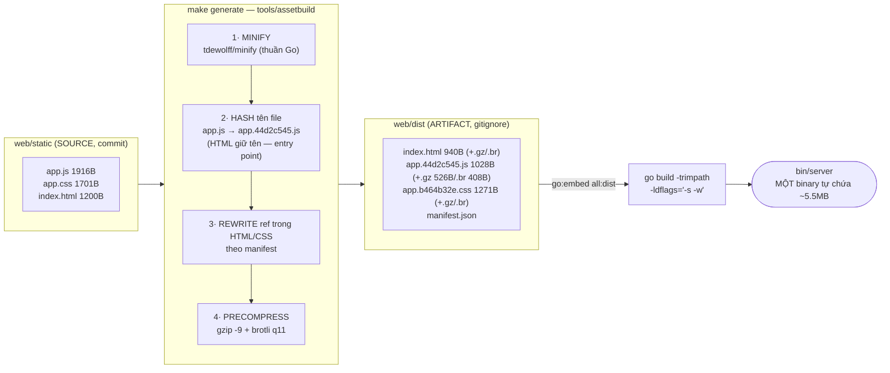
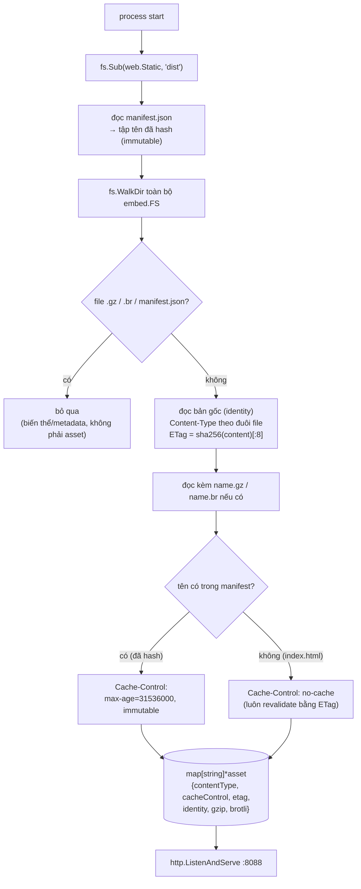

# go_embed_files_example

Ví dụ hoàn chỉnh về pipeline static asset cho Go: **minify JS/CSS/HTML → version hóa tên file theo content-hash → nén sẵn gzip/brotli → đóng gói tất cả thành MỘT binary duy nhất** bằng `go:embed`.

- minify: Quá trình loại bỏ các thành phần không cần thiết trong mã nguồn nhưng không làm thay đổi các chức năng của nó
- version hóa theo content-hash: Đặt tên file bằng cách sử dụng giá trị băm tính từ nội dung của file.
   - Nếu sửa nội dung file thì tên cũng sẽ thay đổi theo
- binary: File thực thi, chứa đầy đủ html/css/js của app

Ý tưởng cốt lõi: mọi việc tốn CPU (minify, nén mức cao nhất) làm **một lần lúc build**; lúc serve chỉ còn tra map và copy bytes. Tên file nhúng hash nội dung (`app.44d2c545.js`) nên asset được cache **bất tử 1 năm** — nội dung đổi thì URL đổi, không bao giờ cache nhầm bản cũ.

- Map: Là một bản ghi chứa key, và tên file asset (html/js/css). Tra map, nghĩa là khi trình duyệt request app.js thì server lấy ra key, trả về dữ liệu
- Copy bytes: File asset (html/js/css) lúc này đã được chuyển thành bytes. Copy byte nghĩa là việc sao chép byte từ các file này và gửi trả về cho client 
## Quickstart

```bash
make run          # assetbuild → build → chạy server tại :8088
# mở http://localhost:8088 — trang demo tự hiển thị bảng transfer size

make test         # assetbuild → go test -race ./...
make build        # ra bin/server (~5.5MB, tự chứa 100%)
make clean        # xóa binary + web/dist
```

Deploy = copy đúng **1 file** `bin/server`. Không cần thư mục static, không cần Node trên server, không cần nginx đứng trước để nén.

Kiểm tra bằng curl trên binary đã build:

```bash
curl -s localhost:8088/ | head -c 200
# <!doctype html><html lang=vi><meta charset=utf-8>...     ← HTML đã minify
# ...href=/static/app.b464b32e.css                         ← ref đã rewrite sang tên hash

curl -sI -H 'Accept-Encoding: gzip, br' localhost:8088/static/app.44d2c545.js
# Cache-Control: public, max-age=31536000, immutable       ← cache bất tử
# Content-Encoding: br
# Content-Length: 408          (gốc 1916B → minify 1028B → brotli 408B, -79%)
# ETag: "44d2c545…-br"
# Vary: Accept-Encoding

curl -sI localhost:8088/static/app.js
# 404 — tên gốc không tồn tại nữa, chỉ tên đã version hóa được serve
```

## Cấu trúc project

```
go_embed_files_example/
├── main.go                      # HTTP server, routing (port 8088)
├── Makefile                     # generate → build (thứ tự BẮT BUỘC)
├── tools/assetbuild/main.go     # minify + hash + rewrite + nén, chạy TRƯỚC go build
├── web/
│   ├── embed.go                 # //go:embed all:dist
│   ├── static/                  # SOURCE (commit) — file gốc dev sửa
│   │   ├── index.html
│   │   ├── app.css
│   │   └── app.js
│   └── dist/                    # ARTIFACT (gitignore) — output assetbuild
│       ├── index.html           #   đã minify + rewrite ref (giữ tên: entry point)
│       ├── app.44d2c545.js      #   đã minify, tên = content-hash
│       ├── app.b464b32e.css
│       ├── *.gz / *.br          #   biến thể nén sẵn của từng file
│       └── manifest.json        #   map tên gốc → tên hash (không serve ra ngoài)
└── internal/assets/
    ├── assets.go                # load 1 lần + negotiation + cache policy + Path()
    └── assets_test.go
```

---

## Mô hình thực thi

### 1. Build pipeline — `make build`

Thứ tự là bất biến quan trọng nhất: **`go:embed` chỉ nhúng file tồn tại tại thời điểm build**, nên assetbuild phải chạy trước. Makefile mã hóa ràng buộc này (`build: generate`). Vì `web/dist` nằm trong `.gitignore`, chạy `go build` "chay" khi chưa generate sẽ **fail ngay** (`pattern all:dist: no matching files`) — guard có chủ đích chống build thiếu bước.



Thứ tự hash bên trong assetbuild có chủ đích — hash phải tính **sau** khi nội dung chốt:

1. **Asset "lá"** (js, ảnh, font…): minify → hash.
2. **CSS**: rewrite `url(...)` sang tên đã hash → minify → hash (nội dung CSS đổi sau rewrite nên hash tính sau cùng).
3. **HTML**: rewrite mọi `/static/x` sang tên hash → minify → **giữ nguyên tên** (URL entry point phải ổn định).

### 2. Khởi động server — index hóa asset một lần

`internal/assets` quét `embed.FS` **một lần duy nhất** lúc process start. `embed.FS` bất biến suốt đời process nên không cần cache/lock/invalidation runtime — mỗi request chỉ là một lần tra `map`.



### 3. Xử lý request — content negotiation + cache

```mermaid
sequenceDiagram
    autonumber
    participant B as Browser
    participant M as ServeMux
    participant H as assets.Serve
    participant FS as map (RAM, từ embed)

    B->>M: GET / (Accept-Encoding: gzip, br)
    M->>H: Serve(w, r, "index.html")
    H-->>B: 200 · Cache-Control: no-cache · Content-Encoding: br<br/>body: HTML minified, ref = /static/app.44d2c545.js

    B->>M: GET /static/app.44d2c545.js
    M->>H: StripPrefix("/static/") → name
    H->>H: path.Clean (chặn ../ traversal)
    H->>FS: files["app.44d2c545.js"]
    H->>H: chọn biến thể: br? → gzip? → identity
    Note over H: ETag riêng từng representation:<br/>"44d2…" / "44d2…-gz" / "44d2…-br"
    H-->>B: 200 · Content-Encoding: br · Content-Length: 408<br/>Cache-Control: public, max-age=31536000, immutable

    Note over B: Lần sau: asset hash lấy thẳng từ cache,<br/>KHÔNG có request nào tới server

    B->>M: GET / (lần sau, If-None-Match: "54d9…-br")
    M->>H: Serve(w, r, "index.html")
    H-->>B: 304 Not Modified (không body)

    Note over B,H: Khi deploy bản mới: index.html revalidate → thấy ref mới<br/>app.<hash-mới>.js → tải asset mới; bản cũ tự hết hiệu lực
```

Thứ tự ưu tiên encoding: **brotli → gzip → identity**. Client gửi `q=0` cho encoding nào thì loại encoding đó; client không có `Accept-Encoding` nhận bản gốc — không bao giờ vỡ.

---

## Chi tiết từng thành phần

### `tools/assetbuild` — build một lần, serve rẻ mãi

| Việc | Công cụ | Kết quả đo được (project này) |
|---|---|---|
| Minify JS | `tdewolff/minify/v2/js` | 1916B → 1028B (54%) |
| Minify CSS | `…/css` | 1701B → 1271B (75%) |
| Minify HTML | `…/html` | 1200B → 940B (78%) |
| Version hóa | sha256(content)[:8] vào tên | `app.44d2c545.js` |
| Nén gzip -9 | stdlib | js: 1028B → 526B |
| Nén brotli q11 | `andybalholm/brotli` | js: 1028B → **408B** (-79% so gốc) |

- Toàn bộ **thuần Go** — không cần Node/terser trên máy build. Dự án có bundler sẵn (Vite/esbuild đã minify + hash) thì bỏ bước minify/hash ở đây, chỉ giữ precompress + embed + serve.
- `web/dist` **xóa sinh lại từ đầu** mỗi lần chạy — không bao giờ có artifact stale/mồ côi.
- Chỉ ghi `.gz`/`.br` khi thực sự nhỏ hơn bản gốc; chỉ nén định dạng text-based (ảnh/woff2 đã nén sẵn).
- Rewrite ref bằng thay chuỗi `/static/<tên gốc>` → `/static/<tên hash>` (+ dạng `url(...)` cho CSS) — đủ cho demo; dự án thật để bundler lo, cơ chế phía server không đổi.

### `web/embed.go` — điểm nhúng

```go
//go:embed all:dist
var Static embed.FS
```

- `go:embed` **không dùng được `..`** — file embed phải nằm cùng package với thư mục nhúng, nên đặt ngay tại `web/`.
- Nhúng `dist` (artifact) chứ không phải `static` (source): binary chỉ chứa bản đã tối ưu, mỗi asset 3 bản (gốc + gz + br).

### `internal/assets` — các quyết định đáng chú ý

- **Hai chính sách cache, quyết định bằng manifest:**
  - Tên có hash → `public, max-age=31536000, immutable`. Browser không bao giờ hỏi lại; deploy bản mới đổi URL nên không cần purge.
  - `index.html` → `no-cache` (lưu được nhưng luôn revalidate): mỗi lần mở trang browser hỏi lại bằng ETag, thường nhận 304 vài chục byte; khi deploy mới thì nhận HTML mới trỏ sang asset hash mới. **Đây là cặp chính sách chuẩn của mọi SPA.**
- **`assets.Path("app.js")` → `"app.44d2c545.js"`** — helper cho template/handler cần trỏ tới asset; HTML tĩnh thì assetbuild đã rewrite sẵn.
- **`Vary: Accept-Encoding` bắt buộc** — thiếu nó proxy/CDN cache bản brotli rồi trả cho client không hỗ trợ → trang vỡ.
- **ETag riêng cho từng representation** (`"x"`, `"x-gz"`, `"x-br"`) theo RFC 9110.
- **`Content-Type` luôn theo file gốc** (`text/javascript`…) kể cả khi body là bytes brotli — `Content-Encoding` mới là thứ nói "body đã nén". Đây là lỗi phổ biến nhất khi tự serve file `.gz` qua `http.FileServer`.
- **`manifest.json` và biến thể `.gz`/`.br` trả 404** khi truy cập trực tiếp — chúng là chi tiết nội bộ, không phải resource công khai.
- **`Content-Length` set thủ công** khi có `Content-Encoding` (ServeContent bỏ qua trong trường hợp này) — tránh chunked transfer thừa.
- **`http.ServeContent`** lo `If-None-Match` → 304, `Range`, HEAD — không tự viết lại logic conditional request.

### Header trả về — tóm tắt

| Header | Asset hash | index.html | Vì sao |
|---|---|---|---|
| `Cache-Control` | `max-age=31536000, immutable` | `no-cache` | URL bất biến vs entry point phải tươi |
| `Content-Encoding` | `br` / `gzip` / (vắng) | như nhau | Theo negotiation |
| `Content-Type` | theo đuôi file **gốc** | `text/html` | Encoding không đổi bản chất nội dung |
| `Vary` | `Accept-Encoding` | như nhau | Cache trung gian tách bản theo encoding |
| `ETag` | `"hash"` / `"hash-gz"` / `"hash-br"` | như nhau | Revalidation; mỗi representation một ETag |
| `X-Content-Type-Options` | `nosniff` | như nhau | Chặn browser đoán MIME |

---

## Mở rộng cho production

1. **Thêm zstd**: một nhánh trong assetbuild + một `case` trong `Serve` — cấu trúc sẵn cho encoding mới.
2. **Tích hợp Chi/framework khác**: `assets.Handler()` là `http.Handler` chuẩn — `r.Handle("/static/*", http.StripPrefix("/static/", assets.Handler()))`.
3. **SPA fallback**: route bắt-tất-cả gọi `assets.Serve(w, r, "index.html")` cho path không khớp (client-side routing).
4. **Frontend có bundler** (SvelteKit/Vite…): bundler đã minify + hash — assetbuild rút gọn còn mỗi bước precompress lên output của bundler rồi embed như cũ.
5. **File lớn/nhiều**: mỗi asset giữ 3 bản trong RAM (gốc + gz + br). Vài MB asset SPA là không đáng kể; hàng trăm MB media thì embed không còn là công cụ đúng — dùng object storage.

## Điều KHÔNG nên làm

- ❌ Serve thẳng file `.gz` qua `http.FileServer` — sai `Content-Type`, không negotiation.
- ❌ Dùng chung một ETag cho mọi encoding — cache trung gian revalidate nhầm bản.
- ❌ Quên `Vary: Accept-Encoding` — bug chỉ hiện khi có proxy/CDN, cực khó debug.
- ❌ Đặt `immutable` cho file **không** có hash trong tên (nhất là index.html) — user kẹt bản cũ 1 năm, deploy mới không ai thấy.
- ❌ Commit `web/dist` — artifact sẽ lệch source khi quên regenerate; Makefile + guard `go:embed` fail đã đảm bảo thứ tự.
- ❌ Sửa file trong `web/dist` — bị ghi đè ở lần generate sau; source luôn là `web/static`.

## Test

```bash
make test    # assetbuild rồi go test -race ./...
```

Phủ các case: `Path()` trả đúng tên hash (`app\.[0-9a-f]{8}\.js`); tên gốc và `manifest.json` trả 404; CSS đã minify và HTML đã rewrite ref; `Cache-Control` immutable cho asset hash / no-cache cho index.html; negotiation br/gzip/identity + `q=0`; body giải nén khớp nguyên bản; `Content-Type` đúng khi body nén; ETag khác nhau giữa representation; `If-None-Match` → 304; chặn path traversal và truy cập trực tiếp `.gz`/`.br`.
